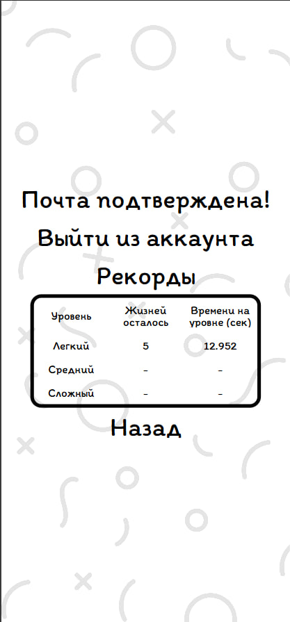
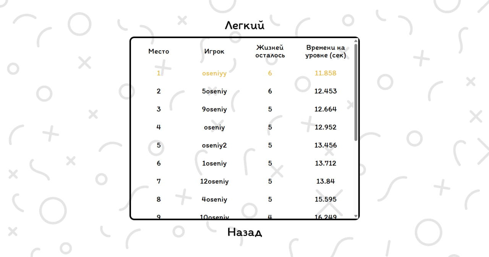

# 🧠 Memory Cards Game

Интерактивная игра на запоминание, где игроку нужно находить пары одинаковых карточек. Разработана с анимацией, адаптивной версткой, прогрессивными уровнями сложности, поддержкой авторизации и системы рекордов.

## 🚀 Функциональность

- 📱 Адаптивная вёрстка для любых экранов
- 🧩 3 уровня сложности: 12, 18, 24 карточки
- 💔 Ограниченное количество жизней
- 🔁 Плавные переходы между экранами
- 🎨 Генерация случайных карточек и цветов
- 🔒 Авторизация через Firebase
- 🧑‍💼 Личный кабинет и рекорды
- 🏆 Лидерборд с фильтрацией по верификации

## 🛠️ Технологии

* HTML + CSS
* Vanilla JavaScript
* Firebase (Authentication + Firestore)
* Vite

## 📈 Скриншоты

  
  
    

## 

## 🎮 Попробовать игру

👉 [Запустить игру онлайн](https://memorycardsgame-6b7d9.web.app)  